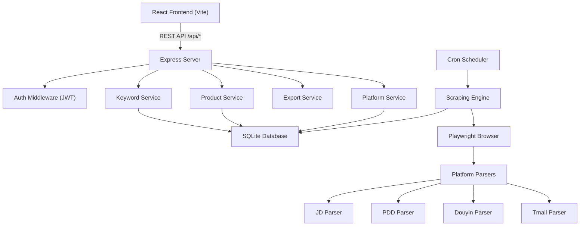
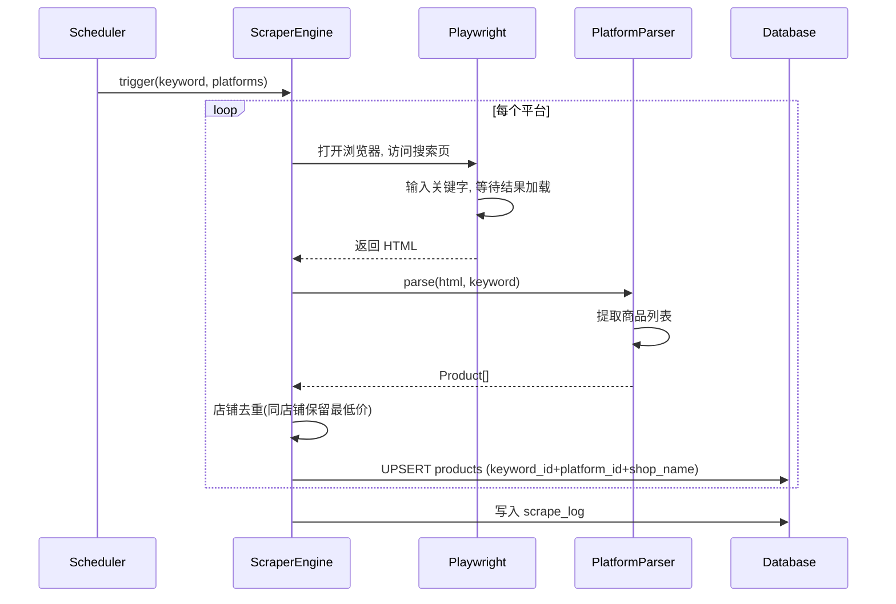

# 商品价格监控系统 - 技术设计

Feature Name: product-price-monitor
Updated: 2026-07-07

## 描述

跨平台商品价格监控系统，支持多用户、多平台（京东、拼多多、抖音、天猫）的商品价格自动化采集与低价预警。前端采用 React + Ant Design 后台管理风格，后端采用 Node.js + Express + SQLite，采集引擎基于 Playwright 无头浏览器。

## 架构



系统分为三个进程层：
- **Web Server**：Express 服务，处理前端请求、用户认证、CRUD 操作和数据导出
- **Scheduler**：内置在 Express 进程中，通过 node-cron 管理定时采集任务
- **Scraper Engine**：封装 Playwright 浏览器实例，按平台分发到对应的解析器

## 组件与接口

### 1. 前端路由与组件

```
/login            → LoginPage        (登录)
/register         → RegisterPage     (注册)
/                 → DashboardPage    (首页概览)
/keywords         → KeywordListPage  (关键字管理)
/keywords/new     → KeywordFormPage  (新建关键字)
/keywords/:id     → KeywordFormPage  (编辑关键字)
/products         → ProductListPage  (低价商品列表)
/products/:id     → ProductDetail    (商品详情)
/tasks            → TaskListPage     (采集任务管理)
```

**组件树**：
- `AppLayout`：侧边栏导航 + 顶栏 + 内容区
  - `SideMenu`：导航菜单（概览、关键字、商品监控、采集任务）
  - `AuthGuard`：路由守卫，未登录跳转登录页

**状态管理**：React Context + useReducer，按模块拆分：
- `AuthContext`：用户登录状态、令牌
- `KeywordContext`：关键字列表、当前编辑项
- `ProductContext`：商品列表、筛选条件、分页

### 2. 后端 API 路由

| 方法   | 路径                          | 说明           | 认证 |
|--------|-------------------------------|----------------|------|
| POST   | /api/auth/register            | 用户注册       | 否   |
| POST   | /api/auth/login               | 用户登录       | 否   |
| GET    | /api/auth/me                  | 当前用户信息   | 是   |
| GET    | /api/platforms                | 平台列表       | 是   |
| PUT    | /api/platforms/:id            | 更新平台配置   | 是   |
| GET    | /api/keywords                 | 关键字列表     | 是   |
| POST   | /api/keywords                 | 创建关键字     | 是   |
| PUT    | /api/keywords/:id             | 更新关键字     | 是   |
| DELETE | /api/keywords/:id             | 删除关键字     | 是   |
| POST   | /api/keywords/:id/scrape      | 手动触发采集   | 是   |
| GET    | /api/products                 | 商品列表(筛选) | 是   |
| GET    | /api/products/stats           | 商品统计数据   | 是   |
| GET    | /api/export/excel             | 导出 Excel     | 是   |
| GET    | /api/export/csv               | 导出 CSV       | 是   |
| GET    | /api/tasks                    | 采集任务日志   | 是   |

### 3. 采集引擎



**Parser 接口**（每个平台实现）：
```typescript
interface PlatformParser {
  name: string;
  parse(html: string, keyword: string): ParsedProduct[];
}

interface ParsedProduct {
  shopName: string;
  productName: string;
  price: number;
  shopUrl: string;
  productUrl: string;
  imageUrl?: string;
}
```

**各平台解析器适配策略**：

| 平台   | 搜索 URL 模式                           | 解析要点                                      |
|--------|----------------------------------------|-----------------------------------------------|
| 京东   | `search.jd.com/Search?keyword=...`     | CSS selector 提取 `.gl-item` 中的价格和标题   |
| 拼多多 | `mobile.yangkeduo.com/search?q=...`    | 移动端页面解析，商品卡片提取                  |
| 抖音   | `haohuo.jinritemai.com/views/search?...`| 抖音商城的搜索结果页解析                      |
| 天猫   | `list.tmall.com/search_product.htm?q=...`| 天猫搜索结果页，注意区分天猫和淘宝商品        |

**店铺去重策略**：

去重维度为 `keyword_id + platform_id + shop_name`（同一关键字同一平台下相同店铺）。解析器返回商品列表后，在写入数据库前执行去重：

1. 按 `shop_name` 归一化（去除空格、统一大小写）后分组
2. 同组内仅保留 `price` 最低的一条记录
3. 已存在同维度记录的，使用 UPSERT（价格更低则更新，否则保留旧记录）

```typescript
function dedupByShop(products: ParsedProduct[]): ParsedProduct[] {
  const map = new Map<string, ParsedProduct>();
  for (const p of products) {
    const key = normalizeShopName(p.shopName);
    const existing = map.get(key);
    if (!existing || p.price < existing.price) {
      map.set(key, p);
    }
  }
  return Array.from(map.values());
}
```

### 4. 定时任务调度

```typescript
interface ScheduledTask {
  keywordId: number;
  intervalMinutes: number;
  cronExpression: string;
  job: CronJob;
}
```

调度器在 Express 启动时加载所有活跃关键字，为每个关键字创建 cron 任务。当用户更新关键字的采集间隔时，动态重建对应的 cron 任务。

## 数据模型

```sql
-- 用户表
CREATE TABLE users (
  id INTEGER PRIMARY KEY AUTOINCREMENT,
  username TEXT NOT NULL UNIQUE,
  password_hash TEXT NOT NULL,
  created_at DATETIME DEFAULT CURRENT_TIMESTAMP
);

-- 平台表（内置数据）
CREATE TABLE platforms (
  id INTEGER PRIMARY KEY AUTOINCREMENT,
  code TEXT NOT NULL UNIQUE,       -- jd, pdd, douyin, tmall
  name TEXT NOT NULL,              -- 京东, 拼多多, 抖音, 天猫
  icon TEXT,                       -- 图标标识
  enabled INTEGER DEFAULT 1,
  parser_config TEXT,              -- JSON: 平台解析器自定义配置
  search_url_template TEXT,        -- 搜索 URL 模板
  created_at DATETIME DEFAULT CURRENT_TIMESTAMP
);

-- 关键字表
CREATE TABLE keywords (
  id INTEGER PRIMARY KEY AUTOINCREMENT,
  user_id INTEGER NOT NULL REFERENCES users(id),
  text TEXT NOT NULL,              -- 关键字文本
  price_limit REAL NOT NULL,       -- 限价金额
  interval_minutes INTEGER DEFAULT 30,
  enabled INTEGER DEFAULT 1,
  created_at DATETIME DEFAULT CURRENT_TIMESTAMP,
  updated_at DATETIME DEFAULT CURRENT_TIMESTAMP
);

-- 关键字-平台关联表
CREATE TABLE keyword_platforms (
  id INTEGER PRIMARY KEY AUTOINCREMENT,
  keyword_id INTEGER NOT NULL REFERENCES keywords(id) ON DELETE CASCADE,
  platform_id INTEGER NOT NULL REFERENCES platforms(id),
  UNIQUE(keyword_id, platform_id)
);

-- 商品采集结果表
CREATE TABLE products (
  id INTEGER PRIMARY KEY AUTOINCREMENT,
  keyword_id INTEGER NOT NULL REFERENCES keywords(id) ON DELETE CASCADE,
  platform_id INTEGER NOT NULL REFERENCES platforms(id),
  shop_name TEXT NOT NULL,
  product_name TEXT NOT NULL,
  price REAL NOT NULL,
  shop_url TEXT,
  product_url TEXT,
  image_url TEXT,
  scraped_at DATETIME NOT NULL,
  below_limit INTEGER DEFAULT 0,  -- 低于限价: 1, 不低于: 0
  UNIQUE(keyword_id, platform_id, shop_name)  -- 店铺去重约束
);

-- 采集日志表
CREATE TABLE scrape_logs (
  id INTEGER PRIMARY KEY AUTOINCREMENT,
  keyword_id INTEGER NOT NULL REFERENCES keywords(id) ON DELETE CASCADE,
  platform_id INTEGER NOT NULL REFERENCES platforms(id),
  status TEXT NOT NULL,            -- success, failed
  error_message TEXT,
  product_count INTEGER DEFAULT 0,
  started_at DATETIME NOT NULL,
  completed_at DATETIME
);
```

## 正确性约束

- 价格字段统一使用 REAL（浮点数），比较时容差 0.01 元
- 同一关键字、同一平台、同一店铺名下仅保留价格最低的一条商品记录
- 店铺名称去重前做归一化处理（去除首尾空格、连续空格合并为单个空格），避免因空格差异产生重复
- 每个用户的商品数据通过 `user_id`（经 keyword → user_id）严格隔离
- 平台删除或禁用后，关联的采集任务自动跳过
- 密码使用 bcrypt 哈希存储，不保存明文
- JWT 令牌有效期 24 小时

## 错误处理

| 场景                   | 处理策略                                         |
|------------------------|--------------------------------------------------|
| 平台搜索页加载超时     | 30 秒超时，记录日志，跳过该平台继续下一个          |
| 平台 HTML 结构变更     | 解析器返回空数组，记录解析错误日志                |
| Playwright 浏览器崩溃  | 自动重启浏览器实例，重试当前失败任务（最多 2 次）  |
| 数据库写入失败         | 记录错误并终止当前采集任务，保留已写入的数据      |
| JWT 令牌过期           | 返回 401，前端自动跳转登录页                      |
| 并发采集冲突           | 同一关键字同时只允许一个采集任务运行（互斥锁）    |

## 测试策略

- **单元测试**：各平台解析器（jest + 模拟 HTML）
- **API 测试**：supertest 覆盖所有 REST 端点
- **采集集成测试**：使用 Playwright 的 mock 模式验证采集流程
- **前端组件测试**：React Testing Library 测试关键交互

## 技术选型

| 层级       | 技术                      | 选型理由                     |
|------------|---------------------------|------------------------------|
| 前端框架   | React 18 + Vite           | 生态成熟，后台管理组件丰富   |
| UI 组件库  | Ant Design 5              | 表格、表单、侧边栏开箱即用   |
| HTTP 请求  | axios                     | 拦截器支持，方便附加 JWT     |
| 后端框架   | Express 4                 | 轻量、中间件生态完善         |
| 数据库     | better-sqlite3            | 零配置、无需独立服务         |
| ORM        | knex                      | SQL builder，灵活可控        |
| 认证       | jsonwebtoken + bcryptjs   | JWT 标准方案                 |
| 采集引擎   | playwright                | 跨浏览器支持，API 友好       |
| 定时任务   | node-cron                 | 轻量 cron 表达式调度         |
| Excel 导出 | exceljs                   | 支持多 sheet、样式定制       |
| CSV 导出   | csv-stringify             | 流式写入，内存友好           |
| 前端路由   | react-router-dom v6       | React 路由标准方案           |

## 项目结构

```
/workspace/
├── client/                    # React 前端
│   ├── src/
│   │   ├── components/        # 通用组件
│   │   │   ├── AppLayout.tsx
│   │   │   ├── AuthGuard.tsx
│   │   │   └── SideMenu.tsx
│   │   ├── pages/
│   │   │   ├── LoginPage.tsx
│   │   │   ├── RegisterPage.tsx
│   │   │   ├── DashboardPage.tsx
│   │   │   ├── KeywordListPage.tsx
│   │   │   ├── KeywordFormPage.tsx
│   │   │   ├── ProductListPage.tsx
│   │   │   └── TaskListPage.tsx
│   │   ├── contexts/
│   │   │   ├── AuthContext.tsx
│   │   │   └── AppContext.tsx
│   │   ├── services/
│   │   │   └── api.ts         # axios 封装
│   │   ├── App.tsx
│   │   └── main.tsx
│   ├── index.html
│   ├── vite.config.ts
│   └── package.json
├── server/                    # Node.js 后端
│   ├── src/
│   │   ├── index.ts           # 入口
│   │   ├── app.ts             # Express 应用配置
│   │   ├── config.ts          # 配置
│   │   ├── db/
│   │   │   ├── connection.ts  # 数据库连接
│   │   │   ├── migrations/    # Knex 迁移
│   │   │   └── seeds/         # 平台初始数据
│   │   ├── middleware/
│   │   │   └── auth.ts        # JWT 认证中间件
│   │   ├── routes/
│   │   │   ├── auth.ts
│   │   │   ├── keywords.ts
│   │   │   ├── products.ts
│   │   │   ├── platforms.ts
│   │   │   ├── export.ts
│   │   │   └── tasks.ts
│   │   ├── services/
│   │   │   ├── authService.ts
│   │   │   ├── keywordService.ts
│   │   │   ├── productService.ts
│   │   │   └── exportService.ts
│   │   ├── scraper/
│   │   │   ├── engine.ts      # Playwright 封装
│   │   │   ├── scheduler.ts   # Cron 调度
│   │   │   └── parsers/
│   │   │       ├── index.ts   # Parser 注册表
│   │   │       ├── jd.ts      # 京东解析器
│   │   │       ├── pdd.ts     # 拼多多解析器
│   │   │       ├── douyin.ts  # 抖音解析器
│   │   │       └── tmall.ts   # 天猫解析器
│   │   └── utils/
│   │       └── logger.ts
│   ├── tsconfig.json
│   └── package.json
├── start.sh                   # 启动脚本
└── package.json               # 根 package.json (workspaces)
```
