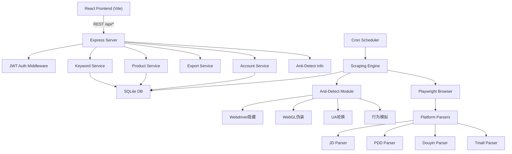
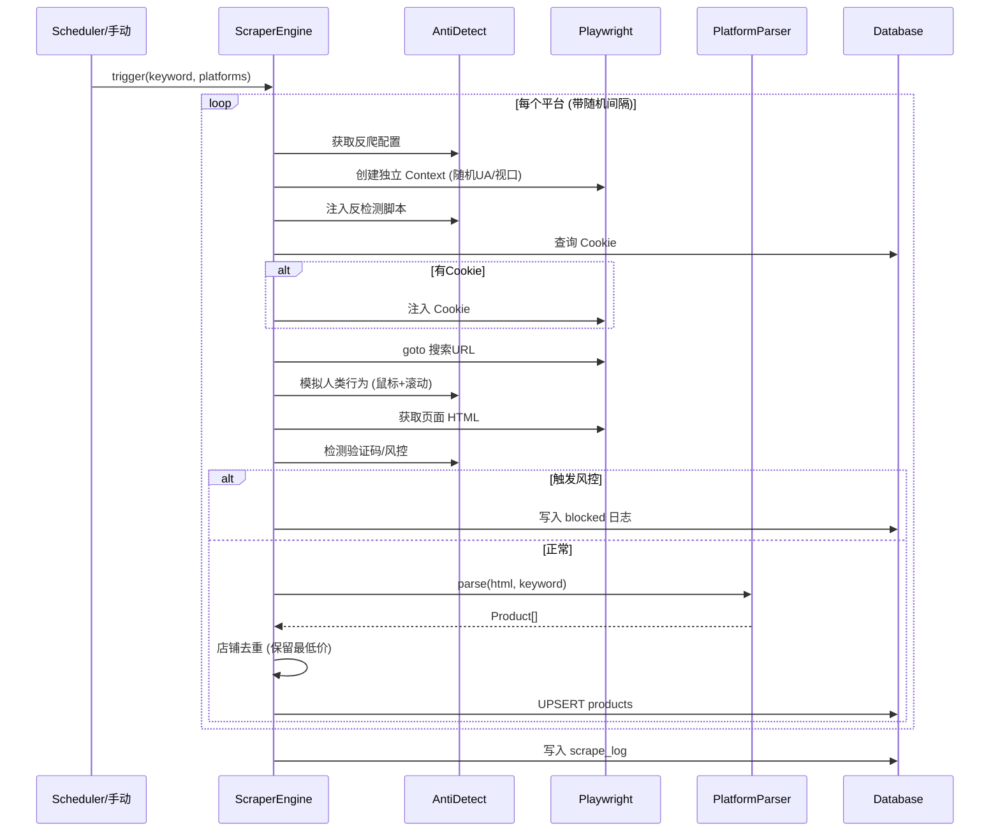

# 商品价格监控系统 (bijia)

跨平台电商商品价格监控系统，支持京东、拼多多、抖音、天猫四大平台的自动化商品搜索与价格采集，自动标记低于限价的商品，并提供 Excel/CSV 数据导出。

## 技术栈

| 层级       | 技术                             |
|------------|----------------------------------|
| 前端       | React 18 + Vite + Ant Design 5   |
| 后端       | Node.js + Express 4 + TypeScript |
| 数据库     | SQLite (better-sqlite3 + Knex)   |
| 采集引擎   | Playwright (Chromium 无头浏览器) |
| 定时任务   | node-cron                        |
| 认证       | JWT + bcryptjs                   |
| Excel 导出 | exceljs                          |
| CSV 导出   | csv-stringify                    |

## 环境要求

- **Node.js** >= 18
- **npm** >= 9
- **操作系统**: Linux (推荐 Ubuntu 22.04+)、macOS、Windows (WSL)

## 快速部署

### 1. 克隆项目

```bash
git clone https://github.com/sbfcel/bijia.git
cd bijia
```

### 2. 安装依赖

```bash
npm install
```

### 3. 安装 Playwright 浏览器

```bash
cd server
npx playwright install chromium
npx playwright install-deps chromium
cd ..
```

### 4. 启动应用

```bash
bash start.sh
```

启动后访问 `http://localhost:5173`，后端 API 运行在 `http://localhost:3001`。

## 目录结构

```
bijia/
├── client/                        # React 前端
│   ├── src/
│   │   ├── components/            # 通用组件 (AppLayout, AuthGuard)
│   │   ├── contexts/              # React Context (AuthContext)
│   │   ├── pages/                 # 页面组件
│   │   │   ├── LoginPage.tsx      # 登录
│   │   │   ├── RegisterPage.tsx   # 注册
│   │   │   ├── DashboardPage.tsx   # 概览仪表盘
│   │   │   ├── KeywordListPage.tsx # 关键字管理
│   │   │   ├── KeywordFormPage.tsx # 关键字编辑
│   │   │   ├── ProductListPage.tsx # 商品监控列表
│   │   │   ├── TaskListPage.tsx    # 采集任务日志
│   │   │   └── AccountListPage.tsx # 平台账号管理
│   │   ├── services/api.ts        # axios 封装
│   │   ├── App.tsx                # 路由配置
│   │   └── main.tsx               # 入口
│   ├── vite.config.ts             # Vite 配置 (含 API 代理)
│   └── package.json
├── server/                        # Express 后端
│   ├── src/
│   │   ├── db/
│   │   │   └── connection.ts      # 数据库连接 + 迁移 + 种子数据
│   │   ├── middleware/
│   │   │   └── auth.ts            # JWT 认证中间件
│   │   ├── routes/
│   │   │   ├── auth.ts            # 登录/注册
│   │   │   ├── platforms.ts       # 平台配置
│   │   │   ├── keywords.ts        # 关键字 CRUD
│   │   │   ├── products.ts        # 商品查询 + 手动采集
│   │   │   ├── export.ts          # Excel/CSV 导出
│   │   │   ├── tasks.ts           # 采集任务日志
│   │   │   ├── accounts.ts        # 平台账号凭证
│   │   │   └── anti-detect.ts     # 反爬配置信息
│   │   ├── scraper/
│   │   │   ├── engine.ts          # 采集引擎 (Playwright)
│   │   │   ├── scheduler.ts       # 定时任务调度 (node-cron)
│   │   │   ├── anti-detect.ts     # 反检测模块
│   │   │   └── parsers/           # 各平台解析器
│   │   │       ├── jd.ts          # 京东解析器
│   │   │       ├── pdd.ts         # 拼多多解析器
│   │   │       ├── douyin.ts      # 抖音解析器
│   │   │       ├── tmall.ts       # 天猫解析器
│   │   │       ├── utils.ts       # 解析工具 (去重/价格清洗)
│   │   │       └── types.ts       # 类型定义
│   │   ├── app.ts                 # Express 应用配置
│   │   ├── config.ts              # 全局配置
│   │   └── index.ts               # 入口
│   └── package.json
├── start.sh                       # 启动脚本
├── package.json                   # Workspace 根配置
└── .gitignore
```

## 数据库

系统使用 SQLite，数据库文件为 `server/data.db`，首次启动时自动创建表结构和种子数据。

### 数据表

| 表名               | 说明                     |
|--------------------|--------------------------|
| users              | 用户表                   |
| platforms          | 平台定义（京东/拼多多/抖音/天猫） |
| keywords           | 关键字与限价             |
| keyword_platforms  | 关键字-平台关联          |
| products           | 商品采集结果             |
| scrape_logs        | 采集执行日志             |
| platform_accounts  | 平台登录凭证             |

## API 接口

所有接口基础路径为 `/api`，除登录/注册外均需 JWT 认证（Header: `Authorization: Bearer <token>`）。

| 方法   | 路径                          | 说明             |
|--------|-------------------------------|------------------|
| POST   | /api/auth/register            | 用户注册         |
| POST   | /api/auth/login               | 用户登录         |
| GET    | /api/auth/me                  | 当前用户信息     |
| GET    | /api/platforms                | 平台列表         |
| PUT    | /api/platforms/:id            | 更新平台配置     |
| GET    | /api/keywords                 | 关键字列表       |
| POST   | /api/keywords                 | 创建关键字       |
| PUT    | /api/keywords/:id             | 更新关键字       |
| DELETE | /api/keywords/:id             | 删除关键字       |
| POST   | /api/products/scrape/:keywordId | 手动触发采集   |
| GET    | /api/products                 | 商品列表(筛选)   |
| GET    | /api/products/stats           | 商品统计数据     |
| GET    | /api/export/excel             | 导出 Excel       |
| GET    | /api/export/csv               | 导出 CSV         |
| GET    | /api/tasks                    | 采集任务日志     |
| GET    | /api/accounts                 | 账号列表         |
| POST   | /api/accounts                 | 添加平台账号     |
| PUT    | /api/accounts/:id             | 更新平台账号     |
| DELETE | /api/accounts/:id             | 删除平台账号     |
| GET    | /api/anti-detect/platforms    | 反爬配置信息     |

### 商品列表接口查询参数

| 参数        | 类型   | 说明                        |
|-------------|--------|-----------------------------|
| keyword_id  | int    | 按关键字筛选                |
| platform_id | int    | 按平台筛选 (1京东/2拼多多/3抖音/4天猫) |
| min_price   | float  | 最低价格                    |
| max_price   | float  | 最高价格                    |
| page        | int    | 页码 (默认 1)               |
| limit       | int    | 每页条数 (默认 20)          |
| sort        | string | price_asc / price_desc / time_desc |

### 导出接口查询参数

| 参数        | 类型   | 说明                       |
|-------------|--------|----------------------------|
| keyword_id  | int    | 按关键字筛选               |
| platform_id | int    | 按平台筛选                 |
| ids         | string | 按商品ID列表导出 (逗号分隔) |

## 使用指南

### 1. 注册与登录

访问系统后先注册账号。每个用户的数据完全隔离。

### 2. 平台账号配置

在 **平台账号** 页面，为各平台配置登录 Cookie 后，采集引擎将在搜索前注入登录态，获取更完整的商品数据。

#### 获取 Cookie 的三种方式

**方式一：浏览器开发者工具（推荐，最通用）**

1. 用 Chrome/Edge 浏览器正常登录目标平台
2. 按 `F12` 打开开发者工具
3. 切换到 **Application**（应用程序）标签页
4. 左侧 Storage → Cookies → 选择目标域名
5. 找到登录相关的关键字段，逐个记录 Name 和 Value
6. 按各平台格式组装 JSON 填入系统

**方式二：EditThisCookie 浏览器插件**

1. 安装 [EditThisCookie](https://www.editthiscookie.com/) 浏览器扩展
2. 登录目标平台后，点击插件图标
3. 点击导出按钮（Export），自动复制全部 Cookie 为 JSON 数组
4. 粘贴到系统中

**方式三：Playwright 脚本自动提取**

在 `server/` 目录下创建以下脚本，运行后自动登录并保存 Cookie：

```javascript
// save-cookies.js - 保存平台 Cookie
const { chromium } = require('playwright');

(async () => {
  const browser = await chromium.launch({ headless: false });
  const page = await browser.newPage();

  // 修改为目标平台登录页
  await page.goto('https://passport.jd.com/new/login.aspx');
  console.log('请在浏览器中完成登录，登录后按回车继续...');

  // 等待手动输入
  await new Promise(resolve => process.stdin.once('data', resolve));

  const cookies = await page.context().cookies();
  console.log(JSON.stringify(cookies, null, 2));

  await browser.close();
})();
```

运行：`cd server && node save-cookies.js`

#### 各平台关键 Cookie 字段

**京东 (jd.com)**

| Cookie 字段 | 说明             | 是否必需 |
|-------------|------------------|----------|
| pt_key      | 登录凭证令牌     | 是       |
| pt_pin      | 用户标识         | 是       |
| pwdt_id     | 设备标识         | 推荐     |
| TrackID     | 跟踪标识         | 可选     |
| thor        | 风控令牌         | 推荐     |

JSON 格式示例：
```json
[
  {"name":"pt_key","value":"app_open_xxxxxxxx","domain":".jd.com","path":"/"},
  {"name":"pt_pin","value":"your_username","domain":".jd.com","path":"/"},
  {"name":"pwdt_id","value":"xxx","domain":".jd.com","path":"/"},
  {"name":"TrackID","value":"xxx","domain":".jd.com","path":"/"}
]
```

**拼多多 (yangkeduo.com)**

| Cookie 字段       | 说明           | 是否必需 |
|-------------------|----------------|----------|
| PDDAccessToken    | 登录访问令牌   | 是       |
| UID               | 用户唯一标识   | 是       |
| JSESSIONID        | 会话标识       | 推荐     |
| api_uid           | API 用户标识   | 推荐     |
| pdd_user_id       | 用户数字 ID    | 可选     |

JSON 格式示例：
```json
[
  {"name":"PDDAccessToken","value":"xxxxxxxx","domain":".yangkeduo.com","path":"/"},
  {"name":"UID","value":"xxxx","domain":".yangkeduo.com","path":"/"},
  {"name":"JSESSIONID","value":"xxxx","domain":".yangkeduo.com","path":"/"},
  {"name":"api_uid","value":"xxxx","domain":".yangkeduo.com","path":"/"}
]
```

> 注意：拼多多反爬等级较高，Cookie 有效期较短。建议使用移动端域名 `mobile.yangkeduo.com` 的 Cookie。

**抖音/抖音商城 (jinritemai.com)**

| Cookie 字段         | 说明         | 是否必需 |
|---------------------|--------------|----------|
| sessionid           | 会话标识     | 是       |
| sessionid_ss        | 安全会话     | 是       |
| passport_csrf_token | CSRF 令牌    | 是       |
| sid_guard           | 会话保护     | 推荐     |
| odin_tt             | 设备指纹     | 推荐     |
| tt_webid            | Web 设备 ID  | 推荐     |

JSON 格式示例：
```json
[
  {"name":"sessionid","value":"xxxxxxxx","domain":".jinritemai.com","path":"/"},
  {"name":"sessionid_ss","value":"xxxxxxxx","domain":".jinritemai.com","path":"/"},
  {"name":"passport_csrf_token","value":"xxxxxxxx","domain":".jinritemai.com","path":"/"},
  {"name":"sid_guard","value":"xxxx","domain":".jinritemai.com","path":"/"},
  {"name":"odin_tt","value":"xxxx","domain":".jinritemai.com","path":"/"}
]
```

> 注意：抖音风控等级极高，Cookie + 设备指纹联动验证。如果采集频繁触发验证码，可尝试在 `server/src/scraper/anti-detect.ts` 中将 delayMax 提高到 12000ms。

**天猫/淘宝 (tmall.com / taobao.com)**

| Cookie 字段  | 说明         | 是否必需 |
|--------------|--------------|----------|
| _tb_token_   | 令牌标识     | 是       |
| cookie2      | 用户标识     | 是       |
| t            | 登录令牌     | 是       |
| unb          | 用户信息     | 推荐     |
| _m_h5_tk     | H5 令牌      | 推荐     |
| _m_h5_tk_enc | H5 加密令牌  | 推荐     |

JSON 格式示例：
```json
[
  {"name":"_tb_token_","value":"xxxxxxxx","domain":".tmall.com","path":"/"},
  {"name":"cookie2","value":"xxxxxxxx","domain":".tmall.com","path":"/"},
  {"name":"t","value":"xxxxxxxx","domain":".tmall.com","path":"/"},
  {"name":"unb","value":"xxxx","domain":".tmall.com","path":"/"},
  {"name":"_m_h5_tk","value":"xxxx","domain":".tmall.com","path":"/"},
  {"name":"_m_h5_tk_enc","value":"xxxx","domain":".tmall.com","path":"/"}
]
```

> 注意：天猫/淘宝与阿里巴巴生态共享登录态，Cookie 有效期通常 24 小时左右，需定期更新。

#### Cookie 维护建议

- 各平台 Cookie 有效期不同（快的数小时，慢的数天），建议每周检查更新
- 采集频率过高会加速 Cookie 失效，已内置反爬延迟策略降低此风险
- 可在"采集任务"页面查看日志，状态为"被拦截"时优先检查 Cookie 是否过期

### 3. 创建关键字监控

在 **关键字管理** 页面：

1. 点击"新建关键字"
2. 输入关键字文本、限价金额
3. 选择要监控的平台（可多选）
4. 设置采集间隔（15分钟 ~ 24小时）

创建后系统自动启动定时采集任务。

### 4. 手动触发采集

在关键字列表中点击"采集"按钮可立即触发一次采集，不等定时任务。

### 5. 查看低价商品

**商品监控** 页面展示所有低于限价的商品，支持：
- 按平台/价格区间筛选
- 价格升序/降序排列
- 多选行导出

### 6. 导出数据

点击"导出 Excel"或"导出 CSV"按钮下载数据文件。Excel 按平台分 sheet 组织，CSV 按逗号分隔。

## 配置说明

### 全局配置 (`server/src/config.ts`)

| 参数                               | 默认值                            | 说明                     |
|------------------------------------|-----------------------------------|--------------------------|
| PORT                               | 3001                              | 后端端口                 |
| JWT_SECRET                         | bijia-jwt-secret-key-2026         | JWT 签名密钥 (生产环境需修改) |
| scrapeTimeout                      | 30000                             | 单次采集超时 (ms)        |
| antiDetect.globalRateLimitPerMinute| 5                                 | 全局每分钟最多采集次数   |
| antiDetect.captchaCooldownMinutes  | 30                                | 触发验证码后冷却时间     |
| antiDetect.browserSessionMaxPages  | 20                                | 浏览器会话最大页面数     |

### 反爬参数 (`server/src/scraper/anti-detect.ts`)

各平台已预设差异化延迟和重试策略。可根据实际情况在 `PLATFORM_ANTI_DETECT` 中调整：

| 平台   | 风控等级 | 请求间隔    | 最大重试 | 滚动页数 |
|--------|----------|-------------|----------|----------|
| 京东   | 中等     | 2s - 5s     | 3        | 3        |
| 拼多多 | 高       | 5s - 8s     | 2        | 4        |
| 抖音   | 极高     | 4s - 7s     | 2        | 5        |
| 天猫   | 高       | 3s - 6s     | 3        | 3        |

### Vite 代理配置 (`client/vite.config.ts`)

前端开发服务器默认代理 `/api` 到 `http://localhost:3001`。如需修改后端地址：

```typescript
server: {
  proxy: {
    '/api': {
      target: 'http://localhost:3001', // 修改为实际后端地址
      changeOrigin: true,
    },
  },
}
```

## 生产部署

### 1. 构建前端

```bash
cd client
npm run build
```

构建产物位于 `client/dist/`。

### 2. 生产启动

后端可直接用 `tsx` 启动，或用 `tsc` 编译后运行：

```bash
# 方式一：直接运行 TypeScript
cd server
npx tsx src/index.ts

# 方式二：编译后运行
npx tsc
node dist/index.js
```

### 3. 使用 PM2 守护进程

```bash
npm install -g pm2
pm2 start server/src/index.ts --interpreter tsx --name bijia-server
pm2 save
```

### 4. 使用 Nginx 反向代理

```nginx
server {
    listen 80;
    server_name your-domain.com;

    # 前端静态文件
    root /path/to/bijia/client/dist;
    index index.html;

    location / {
        try_files $uri $uri/ /index.html;
    }

    # API 代理
    location /api/ {
        proxy_pass http://127.0.0.1:3001;
        proxy_set_header Host $host;
        proxy_set_header X-Real-IP $remote_addr;
    }
}
```

## 环境变量

| 变量名      | 说明     | 默认值                        |
|-------------|----------|-------------------------------|
| PORT        | 后端端口 | 3001                          |
| JWT_SECRET  | JWT 密钥 | bijia-jwt-secret-key-2026     |

生产环境必须修改 `JWT_SECRET`。

## 店铺去重逻辑

同一关键字、同一平台下，相同店铺名称仅保留价格最低的一条记录。去重前对店铺名做归一化处理（去除前后空格、合并连续空格）。

## 常见问题

### Q: Playwright 启动报错 `libglib-2.0.so.0: cannot open shared object file`

```bash
npx playwright install-deps chromium
```

### Q: 采集返回 0 条商品

可能原因：
1. 目标平台页面结构已变更，需更新解析器 CSS 选择器
2. 未配置平台 Cookie，登录墙拦截
3. 触发风控验证码

排查步骤：
1. 查看 **采集任务** 页面对应日志的错误信息
2. 日志状态为 "被拦截" 表示触发了风控，检查反爬配置

### Q: 如何调整采集频率

在 **关键字管理** 页面编辑关键字，修改"采集间隔"即可。或直接修改 `server/src/scraper/anti-detect.ts` 中的平台延迟参数。

### Q: 数据库文件在哪

`server/data.db`。可使用任何 SQLite 客户端查看。

### Q: 如何重置数据

删除 `server/data.db` 后重启服务即可重建。

## 系统架构



## 采集流程


